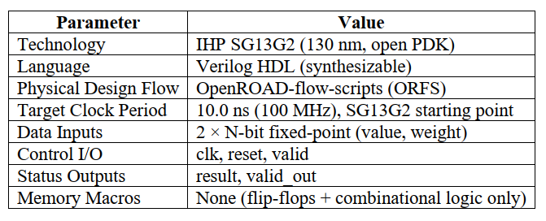

# Unive_OpenSource_Project_Adita

# Approximate Multiply-Accumulate (MAC) Unit for Energy-Efficient Edge AI Inference

## Project Objective: To design, implement and physically build (RTL → GDSII) two versions of a Multiply Accumulate unit, one exact and one approximate, and carry both through the full OpenROAD flow-scripts physical design flow on the open IHP SG13G2 (130 nm) PDK in order to quantify the power/area savings against the accuracy cost of approximation.

## Problem Statement: Exact multipliers and adders in a MAC unit consume significant power and area because of full carry propagation and complete partial-product summation. Neural network inference is inherently error-tolerant - small numerical errors in intermediate computations rarely change the final output. This project asks: How much power and area can be saved by introducing controlled approximation into a MAC unit, and what accuracy cost does this approximation introduce? Answering this with real, physically-implemented numbers gives a concrete, hardware-verified answer for edge-AI chip design decisions.

## Application Domain: Power & Energy Management

## Project Overview: The design takes two N-bit fixed-point inputs (a value and a weight) each cycle, multiplies them and adds the result to a running accumulator register. Two versions are built from the same top level structure: Exact MAC: standard multiplier + full-adder-based accumulate stage.And Approximate MAC: uses the same overall architecture, but incorporates a selected approximate adder in the accumulation stage to reduce hardware complexity and switching activity at the cost of controlled numerical error. Both variants are pushed through the same OpenROAD flow independently, and their synthesis/PnR reports and output accuracy (measured against a set of test input vectors) are compared directly

## Block Diagram:

## Features: 8-bit input operands, Exact and approximate MAC architectures, Fully synchronous digital design, Verilog HDL implementation, Configurable accumulation operation, Designed for energy-efficient edge AI applications, RTL-level functional verification, RTL-to-GDSII implementation using OpenROAD, IHP SG13G2 130 nm technology support, Power, area, timing, and accuracy trade-off analysis.

## Design Specifications:

